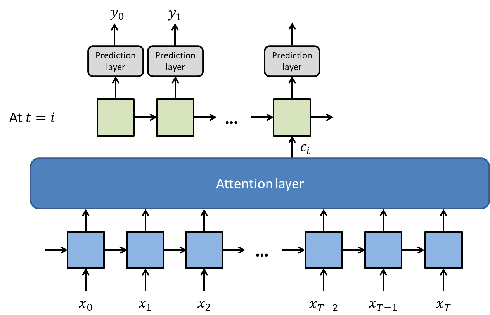

[MathJax](http://www.mathjax.org/) is a simple way of including Tex/LaTex/MathML based mathematics in HTML webpages. To get up and running you need to include the MathJax script in the header of your github pages page, and then write some maths. For LaTex, there are two delimiters you need to know about, one for block or displayed mathematics `\[ ... \]`, and the other for inline mathematics `\( ... \)`.

## Usage

To enable MathJax support be sure Kramdown is your Markdown flavor of choice and MathJax is set to true in your `_config.yml` file.

```yaml
markdown: kramdown
mathjax: true
```

\\[ a^2 + b^2 = c^2 \\]
\\[ x = {-b \pm \sqrt{b^2-4ac} \over 2a} \\]

Here is an example MathJax inline rendering \\( 1/x^{2} \\), and here is a block rendering: 

\\[ \frac{1}{n^{2}} \\]

The only thing to look out for is the escaping of the backslash when using markdown, so the delimiters become `\\[ ... \\]` and `\\( ... \\)` for inline and block maths respectively.

$$ \mathbf{X}\_{n,p} = \mathbf{A}\_{n,k} \mathbf{B}\_{k,p} $$


Testing the display of an image:

{: .align-center}


Testing the display of random code:

```yaml
method(args)
i++
print ("hello world")
```
